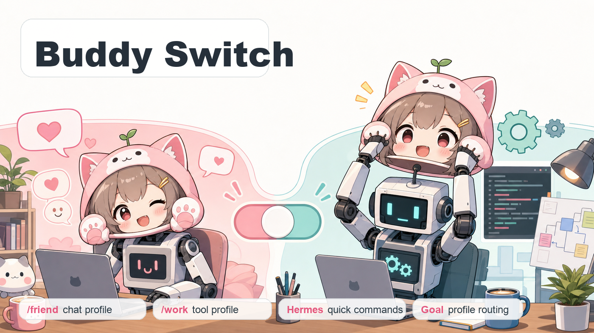
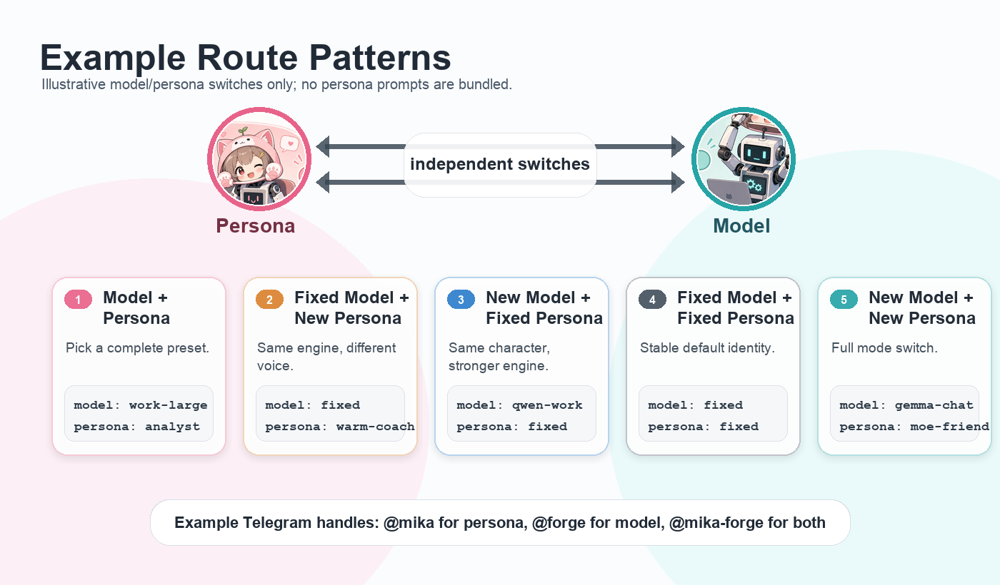
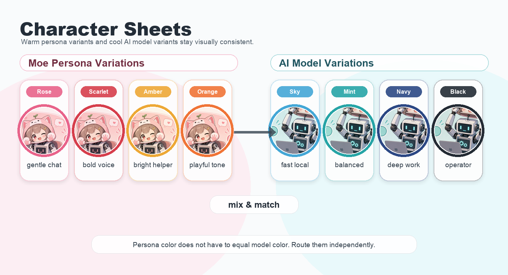

# Buddy Switch





Buddy Switch is a small, practical pattern for running two local Hermes
profiles from the same messaging surface:

- a light "friend" profile for relaxed chat
- a stronger "work" profile for tools, files, search, and terminal tasks

The current workaround switches the active Telegram gateway with `/friend` and
`/work`. The long-term goal is upstream Hermes profile routing, where one
gateway can dispatch a chat, thread, user, or command to the right isolated
profile without restarting the gateway.

This repo is deliberately curated. It is not a copy of a live Hermes home, and
it does not include secrets, state databases, logs, process snapshots, or full
private persona files.

Languages (English is canonical):
[中文](docs/i18n/zh.md) ·
[हिन्दी](docs/i18n/hi.md) ·
[Español](docs/i18n/es.md) ·
[Français](docs/i18n/fr.md) ·
[العربية](docs/i18n/ar.md) ·
[Português](docs/i18n/pt.md) ·
[Русский](docs/i18n/ru.md) ·
[日本語](docs/i18n/ja.md) ·
[한국어](docs/i18n/ko.md) ·
[Deutsch](docs/i18n/de.md)

Translations are ordered roughly by total speaker reach. They may lag behind
the English README; corrections and additional language PRs are welcome.

## What Is Included

- `docs/current-workaround.md`: the working fallback using Hermes quick
  commands and gateway restart scripts.
- `docs/upstream-design.md`: a small upstream-friendly direction for Hermes.
- `docs/testing.md`: the test matrix and naming guard for implementing the
  upstream design without hard-coding maintainer-specific names.
- `docs/fork-readiness.md`: the verified Hermes and OpenClaw fork baseline.
- `docs/personas.md`: how SOUL files, language policy, and model choice fit
  together.
- `docs/friends-picker.md`: the shared `/friends` discovery flow for Telegram
  and terminals.
- `examples/`: generic config, scripts, launchd template, and an optional
  Ollama no-think proxy.
- `references/hermes-issues.md`: relevant upstream issues and adjacent
  projects.

## Install

Fastest path:

```bash
curl -fsSL https://raw.githubusercontent.com/woooya129-ai/buddy-switch/main/install.sh | bash
```

This installs:

- `~/.local/bin/buddy-switch-friend`
- `~/.local/bin/buddy-switch-work`
- `~/.local/bin/buddy-switch-routes`
- `~/.local/bin/buddy-switch-init`
- `~/.local/bin/nothink_proxy.py`
- `~/.config/buddy-switch/config.env`
- starter SOUL drafts under `~/.config/buddy-switch/personas/`
- later, runtime logs go under `~/.local/state/buddy-switch/`

The installer shows real step progress, then a short ASCII eye-opening scene.
On a first interactive install it continues into a small setup wizard for
profile names, response language, and editable SOUL drafts. It never overwrites
an existing Hermes `SOUL.md`.

## Where Does It Go?

Buddy Switch installs helper files next to your user tools. It does not install
Hermes, OpenClaw, models, bot tokens, or credentials.

| Path | What it is |
| --- | --- |
| `~/.local/bin/buddy-switch-friend` | Command run by `/friend` |
| `~/.local/bin/buddy-switch-work` | Command run by `/work` |
| `~/.local/bin/buddy-switch-routes` | Shows the current route, model, personality, and choices |
| `~/.local/bin/buddy-switch-init` | First-run profile and SOUL draft generator |
| `~/.local/bin/nothink_proxy.py` | Optional Ollama `think:false` proxy |
| `~/.config/buddy-switch/config.env` | The one file you usually edit |
| `~/.config/buddy-switch/personas/` | Generated SOUL drafts to review |
| `~/.local/state/buddy-switch/` | Logs created after the first switch |
| `~/.hermes/profiles/<profile>/config.yaml` | Hermes config you edit manually |

If you prefer cloning first:

```bash
git clone https://github.com/woooya129-ai/buddy-switch.git
cd buddy-switch
./install.sh
```

To skip the optional no-think proxy:

```bash
INSTALL_NOTHINK_PROXY=0 ./install.sh
```

See `docs/install.md` for the full setup flow.

## Quick Start

1. Install Hermes and create two profiles, for example:

   ```bash
   hermes profile create buddy-friend --no-skills
   hermes profile create buddy-work
   ```

2. Install Buddy Switch with the one-line installer above.
3. Follow the first-run prompts, or run `buddy-switch-init` later.
4. Review the generated SOUL drafts and place the final versions in the
   matching Hermes profile directories. Back up an existing `SOUL.md` first.
5. Add quick commands like this to both Hermes profile configs:

   ```yaml
   quick_commands:
     friends:
       type: exec
       command: "$HOME/.local/bin/buddy-switch-routes"
       category: catalog
       label: "Choose a friend"
     friend:
       type: exec
       command: "$HOME/.local/bin/buddy-switch-friend"
       category: route
       label: "Friend"
     work:
       type: exec
       command: "$HOME/.local/bin/buddy-switch-work"
       category: route
       label: "Work"
   ```

6. Run `buddy-switch-routes` in a terminal or send `/friends` in Telegram to
   see the current profile, personality, model, and available routes. On stock
   Hermes this is a readable text menu; the Buddy Switch Hermes fork adds
   native Telegram buttons.
7. Choose `/friend` or `/work`, wait for the gateway to switch, then send the
   next message.

See `examples/hermes/config.example.yaml` for a fuller example.

## Persona and Response Language

The response language belongs in each profile's `SOUL.md`, not in Buddy Switch
routing config. A reliable language setup combines:

1. a clear SOUL language-policy block
2. a model that performs well in that language
3. optional provider sampling adjustments only when testing shows language
   mixing

Hermes may cache the built system prompt for an agent or session. After editing
`SOUL.md`, start a new session or restart the relevant gateway if the change is
not visible. See [`docs/personas.md`](docs/personas.md) for starter templates
and model-selection notes.

## Model and Persona Variations



Buddy Switch treats the model and the persona as two independent routing axes.
That lets a Telegram command or future handle choose exactly what should
change:

The table below is an example routing matrix. Buddy Switch does not bundle real
persona prompt files or five finished personalities.

| Route type | Meaning | Example |
| --- | --- | --- |
| Model + Persona | Pick a complete preset. | `work-large` + `analyst` |
| Fixed Model + New Persona | Keep the same engine, change the voice. | `fixed` + `warm-coach` |
| New Model + Fixed Persona | Keep the same character, use a stronger engine. | `qwen-work` + `fixed` |
| Fixed Model + Fixed Persona | Keep the stable default identity. | `fixed` + `fixed` |
| New Model + New Persona | Switch the whole mode. | `gemma-chat` + `moe-friend` |

Today, Buddy Switch exposes this as profile switching through `/friend` and
`/work`. A future Hermes feature can expose the same idea as profile, model,
and persona routing inside one gateway.

## Find Routes Without Memorizing Them

`/friends` is the front door. It answers the three questions people usually
forget:

```text
Who am I talking to?  -> active profile or agent
How will it answer?   -> personality / SOUL
What is running it?   -> provider and model
```

On Telegram, the Hermes fork renders **Personality**, **Model**, and **Routes**
as buttons. A model choice reuses Hermes's existing model picker; a personality
choice reuses `/personality`; a route choice runs only a quick command marked
`category: route`. If buttons are unavailable, the same screen includes exact
text commands.

In a terminal:

```bash
buddy-switch-routes
# Hermes fork CLI also supports:
/friends
/friends personality <name>
/friends model <provider/model>
/friends route <name>
```

See [`docs/friends-picker.md`](docs/friends-picker.md) for the complete behavior.

## Telegram Handles

For a friendlier Telegram UX, Buddy Switch uses two compatible handle shapes.
In the Hermes design they are configured local route names, not Telegram
accounts. In OpenClaw, the most dependable version today is one real Telegram
bot account per agent, with its account display name set to the bot's actual
`@username`.

```text
@mika        -> persona route
@forge       -> model route
@mika-forge  -> combined model + persona route
```

Example messages:

```text
@mika explain this gently
@forge check the logs
@mika-forge summarize this for a human
```

The suggested upstream behavior is:

1. An inline `@handle` can route one message.
2. `/profile @handle` can bind the current chat to that route.
3. `/profile default` can reset the chat to the gateway default.

Until Hermes supports inline handles natively, open `/friends` and tap a route,
or type `/friend` and `/work` as the simple fallback.

## Representative Examples

### Hermes Today: Buddy Switch Fallback

Hermes does not need to know about `friend` or `work` as built-in concepts.
Those names are local quick commands:

```text
/friend
  -> Hermes quick command
  -> ~/.local/bin/buddy-switch-friend
  -> hermes -p buddy-friend gateway start

/work
  -> Hermes quick command
  -> ~/.local/bin/buddy-switch-work
  -> hermes -p buddy-work gateway start
```

### OpenClaw Reference: Native Agent Routing

OpenClaw already has a first-class CLI surface for isolated agents and routing
bindings. Representative examples from its agent docs look like this:

```bash
openclaw agents add work --workspace ~/.openclaw/workspace-work --bind telegram:*
openclaw agents bind --agent work --bind telegram:ops
openclaw agents bindings --agent work
```

For Telegram, bind each agent to a named bot account and set the account's
display `name` to its real bot username. Then `/friends` in the OpenClaw fork
can show a direct button to that bot:

```text
@mika_chat_bot   -> friend agent + its SOUL + its model
@mika_work_bot   -> work agent + its SOUL + its model
```

See [`examples/openclaw/config.example.json5`](examples/openclaw/config.example.json5).
Telegram usernames do not allow hyphens, so use underscores in the real
`@username`; keep a friendlier `Mika - Work` label in prose or UI.

Buddy Switch is the Hermes-side local fallback for the same idea: keep separate
personalities, tools, memory, and workspaces, then route the message to the
right one.

## Current Workaround

The workaround is intentionally simple:

```text
/friend -> quick command -> stop work gateway -> start friend gateway
/work   -> quick command -> stop friend gateway -> start work gateway
```

It works today, but it is not the ideal upstream shape. Restarting the gateway
is a local fallback. A proper Hermes feature should route a message to a named
profile inside a single gateway process.

## Upstream Direction

Buddy Switch is aligned with the profile-routing direction already discussed in
Hermes:

- [#24913: one gateway serves multiple agents](https://github.com/NousResearch/hermes-agent/issues/24913)
- [#40173: Telegram channel_profiles](https://github.com/NousResearch/hermes-agent/issues/40173)
- [#19809: per-channel profile routing for Discord](https://github.com/NousResearch/hermes-agent/issues/19809)

The proposed upstream path is:

1. `telegram.channel_profiles` for static Telegram chat-to-profile routing.
2. `/profile ls` and `/profile <name>` for runtime chat binding.
3. `profile_aliases` so `/friend` and `/work` can be user config, not hard-coded
   Hermes commands.
4. `route_presets` or handle routes so messages can call example names like
   `@mika`, `@forge`, or another configured local name.

## Related Work

OpenClaw already exposes isolated agents and routing bindings in its CLI. Buddy
Switch keeps that idea as a reference point while focusing on Hermes profiles:
[OpenClaw agents docs](https://docs.openclaw.ai/cli/agents).

## Security

`/friend`, `/work`, and the text fallback for `/friends` are `type: exec` quick
commands: anyone who can trigger them runs a local program on your machine. The Telegram allowlist
(`TELEGRAM_ALLOWED_USERS`) is the security boundary — set it in every profile
`.env` before wiring the commands up, and read [SECURITY.md](SECURITY.md) for
the full runtime security model (file permissions, prompt-injection notes for
the work profile, and loopback-only model endpoints).

## License

MIT
