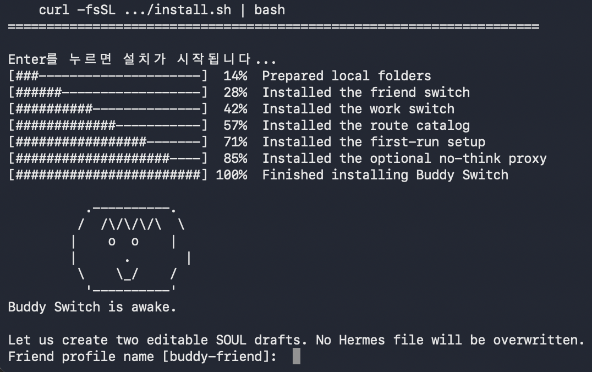

# Install Buddy Switch

Buddy Switch installs local helper commands and editable SOUL drafts. It does
not install or silently rewrite Hermes, OpenClaw, models, Telegram tokens, user
IDs, or live agent configuration.

## The Short Answer: Is It Automatic?

There are two stages:

1. **Install Buddy Switch:** automatic helper installation, local config, and
   SOUL drafts.
2. **Connect an agent:** one-time manual setup in Hermes or OpenClaw because
   only the user knows the correct model, credentials, Telegram account, and
   private personality.

After stage 2, starting the configured Hermes profile or OpenClaw gateway loads
the saved model, persona, tools, and Telegram route automatically.

| Item | Buddy installer handles it? | What the user does once |
| --- | --- | --- |
| Switch commands | Yes | Nothing |
| Buddy local config | Yes | Check profile names and optional model hints |
| SOUL starter drafts | Yes | Review and place them in the real profile/workspace |
| Ollama model | No | Pull and test an exact model tag |
| Hermes profiles and model provider | No | Create and configure each profile |
| Hermes Telegram and quick commands | No | Add credentials and the command block |
| OpenClaw agents and bindings | No | Create agents and bind Telegram accounts |

## One-Line Install

```bash
curl -fsSL https://raw.githubusercontent.com/woooya129-ai/buddy-switch/main/install.sh | bash
```



During an interactive first install, a progress bar tracks the completed
steps. The terminal character opens its eyes, then the setup wizard asks for
two profile names and a response language. It creates drafts; it never
overwrites an existing Hermes `SOUL.md`.

Installed files:

| Path | Purpose |
| --- | --- |
| `~/.local/bin/buddy-switch-friend` | Start the configured friend route |
| `~/.local/bin/buddy-switch-work` | Start the configured work route |
| `~/.local/bin/buddy-switch-routes` | Show route, profile, model hint, persona, and exact commands |
| `~/.local/bin/buddy-switch-init` | Generate local settings and SOUL drafts |
| `~/.local/bin/nothink_proxy.py` | Optional Ollama `think:false` proxy |
| `~/.config/buddy-switch/config.env` | Buddy Switch profile names and model hints |
| `~/.config/buddy-switch/personas/` | Editable SOUL drafts |
| `~/.local/state/buddy-switch/` | Runtime state and switch logs created later |

For a non-interactive install, skip the wizard and run it later:

```bash
BUDDY_SWITCH_RUN_SETUP=0 ./install.sh
buddy-switch-init
```

For scripts or CI:

```bash
buddy-switch-init --yes \
  --friend-profile buddy-friend \
  --work-profile buddy-work \
  --language en
```

## Understand the Three Names

A route name is not a model name:

| Kind | Beginner example | Used by |
| --- | --- | --- |
| Route | `friend` | `/friend` and `buddy-switch-friend` |
| Profile/agent | `buddy-friend` | Hermes or OpenClaw isolation boundary |
| Exact Ollama model | `gemma4:e4b` | The model server and Hermes profile |
| OpenClaw model ref | `ollama/gemma4:e4b` | OpenClaw provider routing |

The route selects a profile or agent. That profile or agent owns the real model,
SOUL, tools, memory, credentials, and workspace.

`FRIEND_MODEL` and `WORK_MODEL` are only model hints shown by `/friends`; the
switch scripts also use them to stop the opposite Ollama model. Setting these
variables does **not** change a Hermes profile's model.

## Choose an Exact Gemma 4 Variant

Do not type `gemma4` only because it is easy to remember. A family/default tag
can move. First inspect this computer:

```bash
ollama list
```

Copy the full `NAME`, including its tag. If no Gemma 4 model is installed, pick
one exact base tag and download it:

```bash
ollama pull gemma4:e4b
ollama show gemma4:e4b
ollama run gemma4:e4b "Reply with exactly: model ready"
```

Example choices from the official Ollama catalog:

| Exact ID | Published size | Context | Beginner interpretation |
| --- | ---: | ---: | --- |
| `gemma4:e2b` | 7.2 GB | 128K | Lowest resource use in this base list |
| `gemma4:e4b` | 9.6 GB | 128K | General local chat starting point |
| `gemma4:12b` | 7.6 GB | 256K | Compact published build with longer context |
| `gemma4:26b` | 18 GB | 256K | Larger MoE option |
| `gemma4:31b` | 20 GB | 256K | Highest-capacity base option listed here |

Published file size is not the amount of RAM guaranteed to be sufficient.
Context length, quantization, concurrent applications, and runtime overhead all
matter. For a work agent, tool-calling reliability is also mandatory: test one
real terminal or file task before choosing the model.

Read [Choosing an Exact Model ID](model-selection.md) for the full decision
rule, specialized tags, language tests, and provider-prefixed OpenClaw names.

## Hermes: One-Time Connection

Buddy Switch's current working route switch is designed for Hermes profiles.

### 1. Install Hermes and Create Profiles

Use the [official Hermes installation](https://github.com/NousResearch/hermes-agent#quick-install),
then create two profiles:

```bash
hermes profile create buddy-friend
hermes profile create buddy-work
hermes profile list
```

Hermes keeps each profile's `config.yaml`, `.env`, `SOUL.md`, model, tools,
memory, sessions, and gateway state separate.

### 2. Configure the Real Model in Each Profile

```bash
hermes -p buddy-friend model
hermes -p buddy-work model
```

For local Ollama, choose the custom endpoint
`http://127.0.0.1:11434/v1`, then paste the exact name copied from
`ollama list`, for example `gemma4:e4b`. Repeat for the second profile; it may
use the same model or a different exact tag.

The model saved by these Hermes commands is authoritative. Buddy Switch does
not replace it during `/friend` or `/work`.

### 3. Check Buddy Switch Names and Hints

```bash
nano ~/.config/buddy-switch/config.env
```

Example:

```bash
FRIEND_PROFILE="buddy-friend"
WORK_PROFILE="buddy-work"
FRIEND_NAME="Mika Chat"
WORK_NAME="Mika Work"

# Optional display/unload hints; match the profile model when using Ollama.
FRIEND_MODEL="gemma4:e4b"
WORK_MODEL="gemma4:31b"
FRIEND_PERSONA_NAME="warm"
WORK_PERSONA_NAME="focused"
```

The installer protects this shell config with mode `600` and its directory
with mode `700`. The scripts refuse to load a group/world-writable config.

### 4. Review and Place the SOUL Drafts

Generated drafts live at:

```text
~/.config/buddy-switch/personas/<profile-name>/SOUL.md
```

Review each draft, then merge it into the matching Hermes profile. Back up an
existing file before changing it:

```text
~/.hermes/profiles/buddy-friend/SOUL.md
~/.hermes/profiles/buddy-work/SOUL.md
```

The SOUL language policy controls the default response language. The model must
also perform well in that language. Start a new session after changing a SOUL.

### 5. Add the Quick Commands to Both Profiles

Add this block to both profile `config.yaml` files:

```yaml
quick_commands:
  friends:
    type: exec
    command: "$HOME/.local/bin/buddy-switch-routes"
    category: catalog
    label: "Choose a friend"
  friend:
    type: exec
    command: "$HOME/.local/bin/buddy-switch-friend"
    category: route
    label: "Friend"
    profile: buddy-friend
    model: "gemma4:e4b"
    personality: "warm"
  work:
    type: exec
    command: "$HOME/.local/bin/buddy-switch-work"
    category: route
    label: "Work"
    profile: buddy-work
    model: "gemma4:31b"
    personality: "focused"
```

Typical locations:

```text
~/.hermes/profiles/buddy-friend/config.yaml
~/.hermes/profiles/buddy-work/config.yaml
```

Configure Telegram credentials and an allowlist in each profile using the
[official Hermes gateway guide](https://hermes-agent.nousresearch.com/docs/user-guide/profiles/).
If both profiles use one bot token, run only one of those gateways at a time;
the Buddy Switch scripts stop the opposite route before starting the target.

Reload the active profile after editing:

```bash
hermes -p buddy-friend gateway restart
```

If no managed gateway service exists yet, follow the Hermes gateway setup and
install steps first. Then `buddy-switch-friend` and `buddy-switch-work` can
start the intended service.

## OpenClaw: One-Time Connection

Buddy Switch does not inject itself into OpenClaw. The standalone repo documents
the equivalent native OpenClaw pattern: isolated agents plus Telegram account
bindings.

1. Run the official guided setup:

   ```bash
   openclaw onboard
   ```

2. Discover exact local models. Copy the full `provider/model` reference:

   ```bash
   openclaw models list --provider ollama
   openclaw models status
   ```

3. After Telegram account IDs such as `friend` and `work` exist, create and
   bind agents:

   ```bash
   openclaw agents add friend \
     --workspace ~/.openclaw/workspace-friend \
     --model ollama/gemma4:e4b \
     --bind telegram:friend

   openclaw agents add work \
     --workspace ~/.openclaw/workspace-work \
     --model ollama/gemma4:31b \
     --bind telegram:work
   ```

4. Verify the saved routes, then start the gateway:

   ```bash
   openclaw agents list --bindings
   openclaw gateway install
   openclaw gateway start
   ```

The account IDs must match real configured OpenClaw Telegram accounts. For two
callable `@names`, use two Telegram bot accounts and bind one account to each
agent. The example config is in
[`../examples/openclaw/config.example.json5`](../examples/openclaw/config.example.json5).

Once saved, starting OpenClaw loads those agents and bindings automatically.
The Buddy Switch installer still does not edit them.

Each real Telegram `@username` is a separate bot chat. Opening
`@mika_gemma_bot` from `@mika_qwen_bot` does not change the Qwen chat into
Gemma; it opens the Gemma agent's conversation. Run `/friends` in the
destination bot to confirm its `THIS CHAT` agent and model.

## Terminal Commands

Terminal commands are used for installation, discovery, persistent setup, and
direct route control.

| Goal | Command | Safe to run repeatedly? |
| --- | --- | --- |
| Show installed Ollama IDs | `ollama list` | Yes, read-only |
| Inspect an exact model | `ollama show gemma4:e4b` | Yes, read-only |
| Test an exact model | `ollama run gemma4:e4b` | Yes; starts a local chat |
| Show Hermes profiles | `hermes profile list` | Yes, read-only |
| Configure friend model | `hermes -p buddy-friend model` | Yes; saves a selection |
| Configure work model | `hermes -p buddy-work model` | Yes; saves a selection |
| Show Buddy routes | `buddy-switch-routes` | Yes, read-only |
| Start friend route | `buddy-switch-friend` | Yes; changes active gateway |
| Start work route | `buddy-switch-work` | Yes; changes active gateway |
| Show OpenClaw model IDs | `openclaw models list --provider ollama` | Yes, read-only |
| Show OpenClaw bindings | `openclaw agents list --bindings` | Yes, read-only |
| Check OpenClaw gateway | `openclaw gateway status` | Yes, read-only |

## Telegram Commands

Telegram is for everyday selection after one-time terminal setup. Do not paste
shell commands such as `ollama list` into Telegram.

| Goal | Hermes with Buddy Switch | Stock OpenClaw |
| --- | --- | --- |
| Show who/model/personality now | `/friends`; require `ACTIVE` | Stock: `/model status`; Buddy fork: `/friends` in the current bot |
| Select friend preset | `/friend`, then recheck `/friends` | Open the bot bound to the friend agent; this is a separate chat |
| Select work preset | `/work`, then recheck `/friends` | Open the bot bound to the work agent; this is a separate chat |
| Open configured model picker | `/model` | `/model` or `/model list` |
| Pick a numbered model | Use Hermes's displayed picker | `/model <number>` |
| Clear a temporary model choice | Start the intended profile again | `/model default` |
| Inspect current model | Hermes fork reads live session; standalone shows confirmed route plus model hint | `/friends` in that bot or `/model status` |

On Hermes, `/friend` and `/work` switch the whole profile: model, SOUL,
tools, memory, and gateway settings. On OpenClaw, talking to a separately bound
bot selects the whole agent. `/model` changes only the session model; it does
not replace the personality or workspace.

## How to Know Setup Is Finished

Run these checks without exposing secrets:

```bash
ollama list
hermes profile list
buddy-switch-routes
```

For Hermes, send `/friends`, switch once, wait, then send `/friends` again.
Continue only when the second screen says `ACTIVE` and shows the intended name,
profile, model, and personality.

For OpenClaw:

```bash
openclaw models status
openclaw agents list --bindings
openclaw gateway status
```

Then message each bound Telegram bot. A successful reply from each bot confirms
that the account, agent, model, and gateway are connected.

## Install Options

Clone first:

```bash
git clone https://github.com/woooya129-ai/buddy-switch.git
cd buddy-switch
./install.sh
```

Skip the optional no-think proxy:

```bash
INSTALL_NOTHINK_PROXY=0 ./install.sh
```

Install into a different bin directory:

```bash
BIN_DIR="$HOME/bin" ./install.sh
```

## Update

Run the installer again. Existing `config.env` is kept unchanged:

```bash
curl -fsSL https://raw.githubusercontent.com/woooya129-ai/buddy-switch/main/install.sh | bash
```

## Uninstall

```bash
rm -f ~/.local/bin/buddy-switch-friend
rm -f ~/.local/bin/buddy-switch-work
rm -f ~/.local/bin/buddy-switch-routes
rm -f ~/.local/bin/buddy-switch-init
rm -f ~/.local/bin/nothink_proxy.py
rm -rf ~/.config/buddy-switch
```

This does not remove Hermes profiles, OpenClaw agents, models, credentials,
Telegram bots, logs, sessions, or gateway services.
